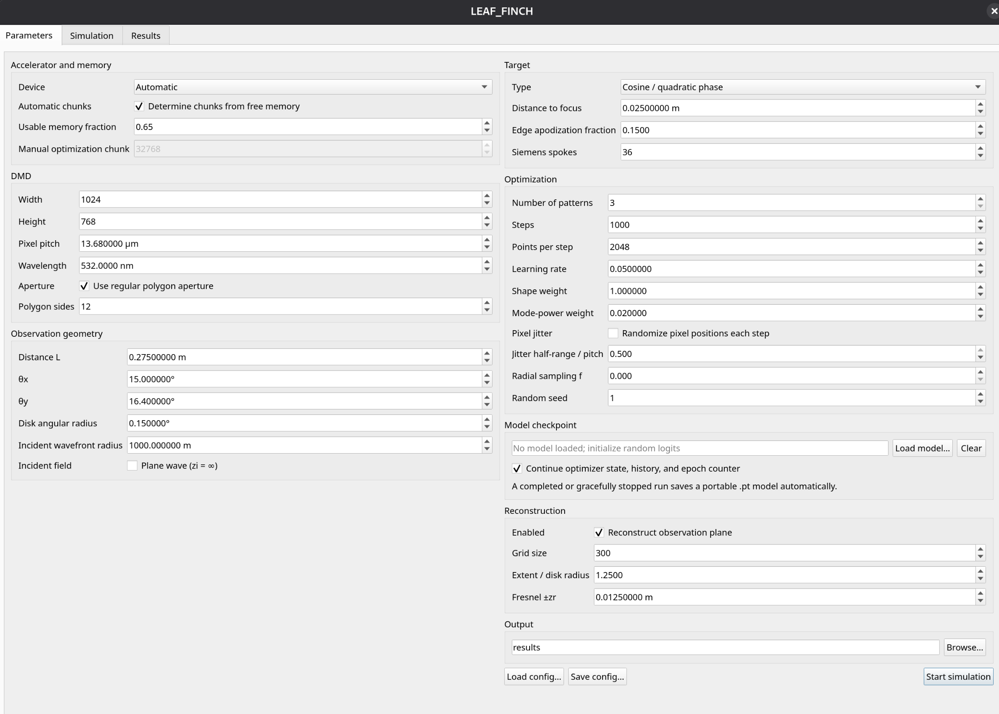
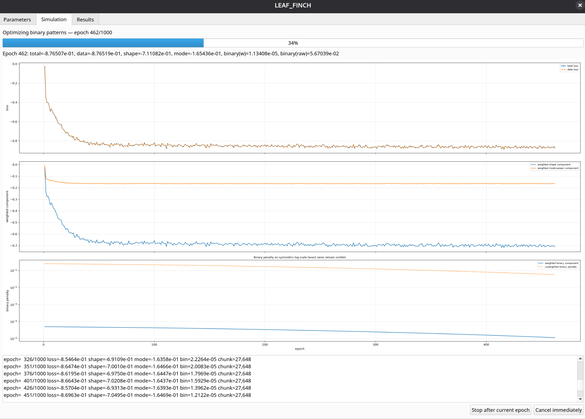
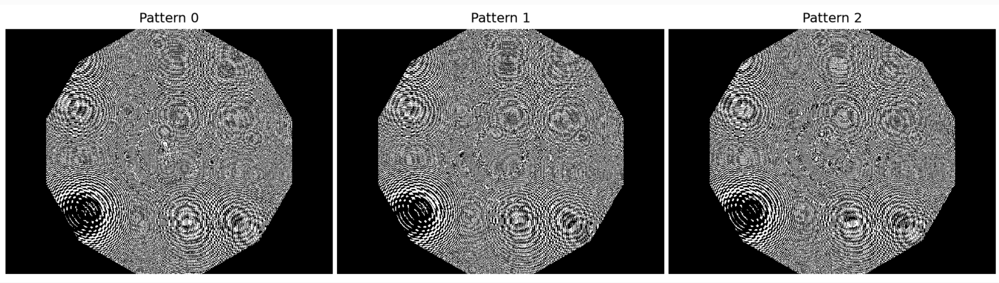
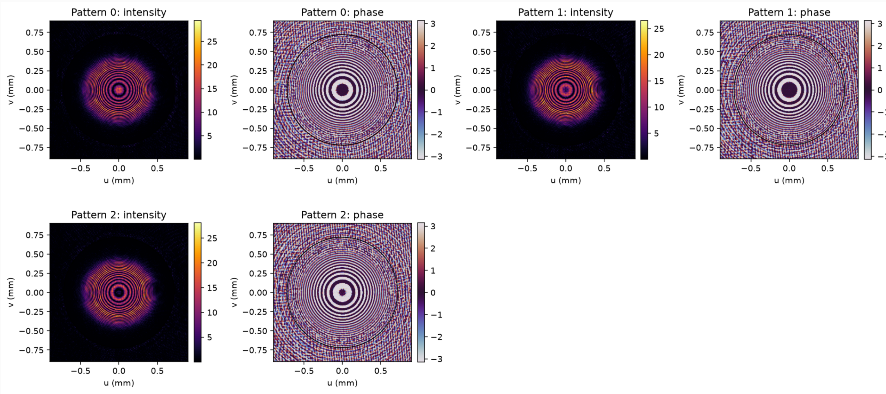
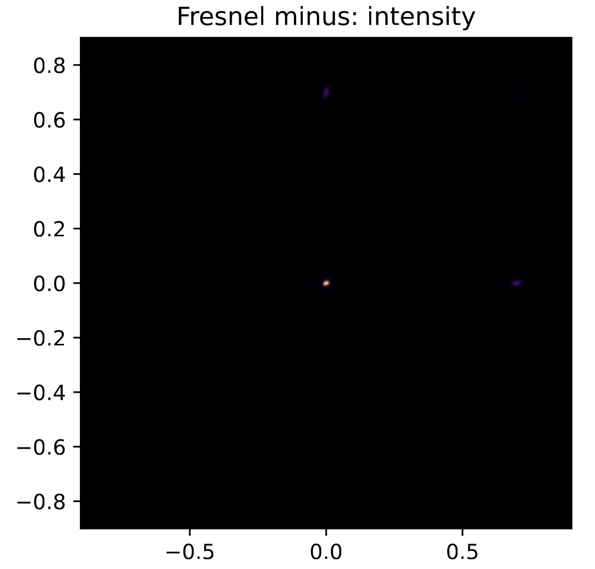

# LEAF-FINCH (Learned Engineering of Amplitude Fields for Fresnel Incoherent Correlation Holography)

**LEAF-FINCH** designs binary-amplitude masks for a digital micromirror device (DMD) using differentiable Rayleigh–Sommerfeld propagation. The masks are optimized such that the complex field generated in an oblique observation plane that is not parallel to the DMD has a strong projection onto a prescribed real-valued target field. Three or more phase-shifted patterns are optimized jointly.

The program includes a PyQt5 graphical interface, a command-line interface, CPU/CUDA/ROCm execution, automatic GPU-memory-aware chunk sizing, field reconstruction, convergence reports, and resumable checkpoints.

Version: **1.0.0**  
Project homepage: <https://github.com/rkotynski/leaf_finch>

## Features

- Nonparaxial point-to-point Rayleigh-Sommerfeld scalar propagation between non-parallel planes.
- Circular optimization target region in a plane with arbitrary direction and radius.
- Binary DMD masks trained with a straight-through estimator.
- Cosine, spherical-wave, Siemens-star, and deterministic Fresnel-Zone-Plate (FZP) targets. Cosine targets are used in the Opt. Lett. paper. FZP targets with Lee hologram encoding are included as a reference [V. Anand and R. Kotynski, “Experimental full-field Fresnel incoherent correlation holography using a digital micromirror device,” Appl. Opt. 65, 5479–5490 (2026)].
- CPU, NVIDIA CUDA, and AMD ROCm support through PyTorch.
- Runtime-selectable English (default) and Polish GUI; file names, configuration keys, output-field names, source-code comments, and screenshots remain English.
- `torch.float32` real tensors and `torch.complex64` optical fields in performance-critical paths.
- Automatic source-pixel and reconstruction chunk selection from available memory.
- Live loss plots, graceful stop after the current epoch, checkpoint save/load, and exact continuation of the local Adam state.
- Pattern export to MATLAB, NumPy, PDF, and PNG formats.
- Reconstruction and convergence output in MAT, CSV, JSON, PDF, PNG, and TXT formats.

## Relation to Lee holography and to superpixel methods

- In this approach, the diffraction image is directly optimized at a selected angle and distance from the binary-amplitude spatial modulator (DMD). This differs from Lee holography, in which the amplitude hologram is encoded from an original complex field modulated by a linear Lee phase and then projected onto the coding domain. In Lee holography, spatial filtering in the Fourier domain is required to retain only the selected diffraction order. In the present case, spatial filtering may help select one of multiple diffraction orders; however, LEAF-FINCH may also be applied directly without spatial filtering.


- In superpixel methods [S. Gopinath, A. Bleahu, T. Kahro, et al., “Enhanced Design of Multi-Plexed Coded Masks for Fresnel Incoherent Correlation Holography,” Sci. Rep. 13, 7390 (2023)], the amplitude hologram is obtained from a complex field, as in Lee holography, whereas in our approach it is optimized directly. Direct optimization is considerably more computationally demanding; however, it does not produce aberrations at larger observation angles and enables target fields to be optimized with high angular resolution near the DMD’s specular-reflection angle, where the diffraction efficiency is highest.
 

- The Python code assumes that the distance from the DMD center to the target center ((L)), the curvatures of the interfering waves at the target—characterized by the distance to the focus, equal to (2z_r)—and the target radius are specified for a setup without additional lenses, particularly without magnification. These parameters may be affected by the presence of Fourier lenses and a spatial filter between the DMD and the observation target.


## Opis po polsku

**LEAF-FINCH** służy do projektowania binarnych masek amplitudowych wyświetlanych na cyfrowym modulatorze mikrolusterkowym (DMD). Optymalizacja wykorzystuje różniczkowalny model dyfrakcji Rayleigha-Sommerfelda i dobiera maski tak, aby zespolone pole w kołowym obszarze ukośnej płaszczyzny obserwacji miało duży rzut na zadane rzeczywiste pole docelowe. Co najmniej trzy wzorce odpowiadające przesunięciom fazowym są optymalizowane wspólnie i mogą następnie służyć do rekonstrukcji zespolonego hologramu FINCH.

Najważniejsze możliwości programu obejmują:

- nieprzyosiową propagację skalarną Rayleigha-Sommerfelda punkt-punkt pomiędzy nierównoległymi płaszczyznami;
- kołowy obszar optymalizacji o dowolnym kierunku osi i promieniu;
- bezpośrednią optymalizację binarnych masek DMD z estymatorem straight-through;
- cele typu cosinus/faza kwadratowa, fale sferyczne, gwiazdy Siemensa oraz deterministyczne FZP;
- obliczenia na CPU, NVIDIA CUDA i AMD ROCm w PyTorch, z użyciem `torch.float32` i `torch.complex64` w krytycznych czasowo fragmentach;
- automatyczny dobór rozmiarów porcji obliczeniowych do dostępnej pamięci akceleratora;
- bieżący wykres składowych funkcji kosztu, łagodne zatrzymanie po bieżącej epoce, zapis/wczytywanie checkpointów i dokładne wznowienie stanu lokalnego optymalizatora Adam;
- rekonstrukcję pola w płaszczyźnie obserwacji oraz propagację Fresnela zespolonego hologramu;
- interfejs GUI w języku angielskim lub polskim. Domyślny jest język angielski. Tłumaczenie dotyczy widżetów, etykiet, komunikatów i opisów wykresów GUI; nazwy plików, klucze konfiguracji, nazwy pól danych, komentarze w kodzie i screenshoty pozostają angielskie.

### Relacja do holografii Lee i metod superpikselowych

W LEAF-FINCH obraz dyfrakcyjny jest optymalizowany bezpośrednio dla wybranego kąta i odległości od binarnego modulatora amplitudy. Jest to inne podejście niż holografia Lee, gdzie hologram amplitudowy powstaje przez zakodowanie zadanego pola zespolonego z dodatkową liniową fazą nośną, a następnie wymaga filtracji przestrzennej wybranego rzędu dyfrakcji w płaszczyźnie Fouriera. W LEAF-FINCH filtracja przestrzenna może być użyteczna do wyboru jednego z rzędów dyfrakcji, ale nie jest warunkiem zastosowania metody.

W metodach superpikselowych amplitudowy hologram również jest konstruowany na podstawie wcześniej zadanego pola zespolonego. LEAF-FINCH optymalizuje natomiast maskę bezpośrednio. Jest to znacznie bardziej kosztowne obliczeniowo, ale pozwala uwzględnić pełną geometrię Rayleigha-Sommerfelda, także przy większych kątach obserwacji, i dokładnie projektować pole w pobliżu kierunku odbicia zwierciadlanego DMD, gdzie sprawność dyfrakcyjna może być największa.

Kod przyjmuje, że odległość od środka DMD do środka obszaru docelowego `L`, krzywizny interferujących fal opisane przez odległość do ogniska `2z_r` oraz promień obszaru docelowego odnoszą się do układu bez dodatkowego powiększenia optycznego. Obecność soczewek Fouriera i filtru przestrzennego pomiędzy DMD a płaszczyzną obserwacji może zmieniać interpretację tych parametrów.

Pełny opis modelu fizycznego, równań i algorytmów pozostaje w angielskiej dokumentacji PDF. Screenshoty programu są również utrzymywane w wersji angielskiej.

## Documentation

The complete physical model, equations, algorithms, GUI workflow, configuration reference, and output format are described in:

- [`docs/LEAF_FINCH_Documentation.pdf`](docs/LEAF_FINCH_Documentation.pdf)
- [`docs/LEAF_FINCH_Documentation.tex`](docs/LEAF_FINCH_Documentation.tex)

## Screenshots


<table>
<tr>
<td width="50%" align="center">
<br>
<em>Figure 1. Parameters tab: device selection, DMD geometry, target definition, optimization settings, and output controls.</em>
</td>
<td width="50%" align="center">
<br>
<em>Figure 2. Simulation tab  showing optimization progress, the textual log, and the three-panel plot of the total loss and its components..</em>
</td>
</tr>
<tr>
<td width="50%" align="center">
<br>
<em>Figure 3. Generated binary masks encoding 3 phase-shifted DMD patterns.</em>
</td>
<td width="50%" align="center">
<br>
<em>Figure 4. Reconstructed field (intensity and phase obtained at a circular off-axis target area; the phase-shifted target image together encode a complex-valued FINCH hologram).</em>
</td>
<td width="50%" align="center">
<br>
<em>Figure 5. Reconstructed PSF of the complex FINCH hologram  (result of phase-shifted hologram reconstruction followed by Fresnel backpropagation).</em>
</td>
</tr>
</table>


## Installation

Python 3.10 or newer is required. PyTorch is installed separately because CPU, CUDA, and ROCm builds use different packages.

```bash
python -m venv .venv
source .venv/bin/activate

# Install the PyTorch build suitable for this computer first.
# See https://pytorch.org/get-started/locally/

pip install -e .
```

For development and tests:

```bash
pip install -e .[dev]
python -m pytest
```

The application intentionally does not use `torch.compile`. The launchers disable TorchDynamo probing to avoid importing optional compiler components that are not required by the numerical method.

## Running the GUI

```bash
leaf-finch-gui
```

The repository also contains a direct launcher:

```bash
python run_gui.py
```

The **Device** selector distinguishes CPU, CUDA, and ROCm. In a ROCm build, PyTorch exposes AMD accelerators through the `torch.cuda` API, so devices retain names such as `cuda:0` internally while the GUI labels the backend as ROCm.

The **Interface language** selector switches the GUI between English (default) and Polish. This is a presentation-only setting and is intentionally not written to `config.json` or model checkpoints. File names, configuration keys, output-field names, source comments, and distributed screenshots remain English.

## Command-line interface

```bash
leaf-finch --config examples/default_config.json
leaf-finch --list-devices
leaf-finch --write-default my_config.json
```

Resume an optimization from a checkpoint:

```bash
leaf-finch --config config.json --model model_checkpoint.pt
```

Use saved logits as initialization while resetting Adam, the epoch counter, and the loss history:

```bash
leaf-finch --config config.json --model model_checkpoint.pt --restart-from-weights
```

Equivalent direct launchers are available as `python run_cli.py ...` and `python -m leaf_finch ...`.

## Output

Each run creates a unique directory under the configured output path. Depending on enabled options, it contains:

- `config.json`: exact run configuration;
- `patterns_*.mat`: bit-packed `uint8` DMD masks in big-endian bit order;
- `patterns_*.npz`: unpacked binary masks;
- `patterns_*.pdf` and `patterns_*.png`: mask previews;
- `convergence_*.csv`, `.json`, `.pdf`, `.png`: complete per-epoch history;
- `model_*.pt`: portable logits, Adam state, history, and continuation metadata;
- `reconstruction_*.mat`, `.pdf`, `.png`: observation-plane fields;
- `hologram_*.pdf`: complex hologram and optional Fresnel reconstructions;
- `run.json` and `info.txt`: configuration, device, numerical types, chunk sizes, and final metrics.

## Repository layout

```text
leaf_finch/
  adam.py             local Adam implementation for the optimized logits tensor
  backend.py          accelerator discovery and automatic chunk sizing
  cli.py              command-line interface
  config.py           validated configuration dataclasses and JSON I/O
  geometry.py         DMD aperture and oblique observation-plane geometry
  gui/                PyQt5 interface and worker thread
  io.py               pattern, reconstruction, report, and metadata output
  optimization.py     straight-through binary optimization
  propagation.py      Rayleigh-Sommerfeld and Fresnel propagation
  reconstruction.py   observation-plane field reconstruction
  runner.py           complete simulation orchestration
  targets.py          target modes and deterministic FZP masks
  training_state.py   portable checkpoint save/load

docs/                 PDF documentation and its LaTeX source
examples/             example JSON configuration
tests/                automated tests
```

## Citation

The accompanying article has been accepted for *Optics Letters* and has a DOI, while final volume/issue/page data are not yet available. Please cite the current posted version as:

> Vijayakumar Anand, Rafał Stojek, and Rafał Kotyński, “Learned binary amplitude mask designs for Fresnel incoherent correlation holography”, *Optics Letters* (posted 08/10/2026), doi: 10.1364/OL.609636.

DOI: <https://doi.org/10.1364/OL.609636>

A machine-readable citation is provided in [`CITATION.cff`](CITATION.cff), and a BibTeX entry is provided in [`CITATION.bib`](CITATION.bib).

## Use of AI

Parts of the code and its documentation were developed with the assistance of large language model (LLM) tools.

## Acknowledgement

Vijayakumar Anand acknowledges financial support from the NAWA ULAM project of the Polish National Agency for Academic Exchange (BPN/ULM/2025/1/00097/U/DRAFT/00001) 

## License

LEAF_FINCH is released under the [MIT License](LICENSE). This permits academic, commercial, and private use, modification, and redistribution, provided that the copyright and license notices are retained.

## Contributing

Bug reports and contributions are welcome. See [`CONTRIBUTING.md`](CONTRIBUTING.md) before opening a pull request. Security-sensitive reports should follow [`SECURITY.md`](SECURITY.md).
